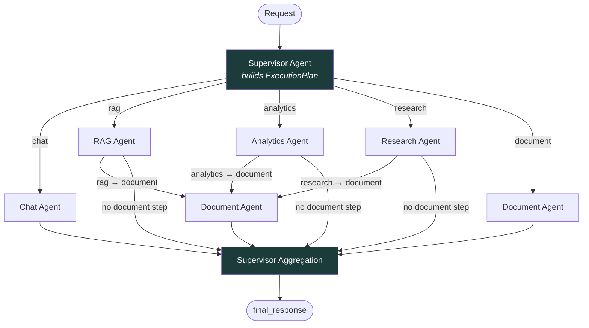
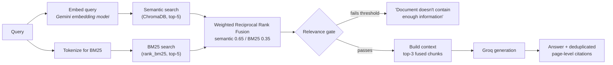
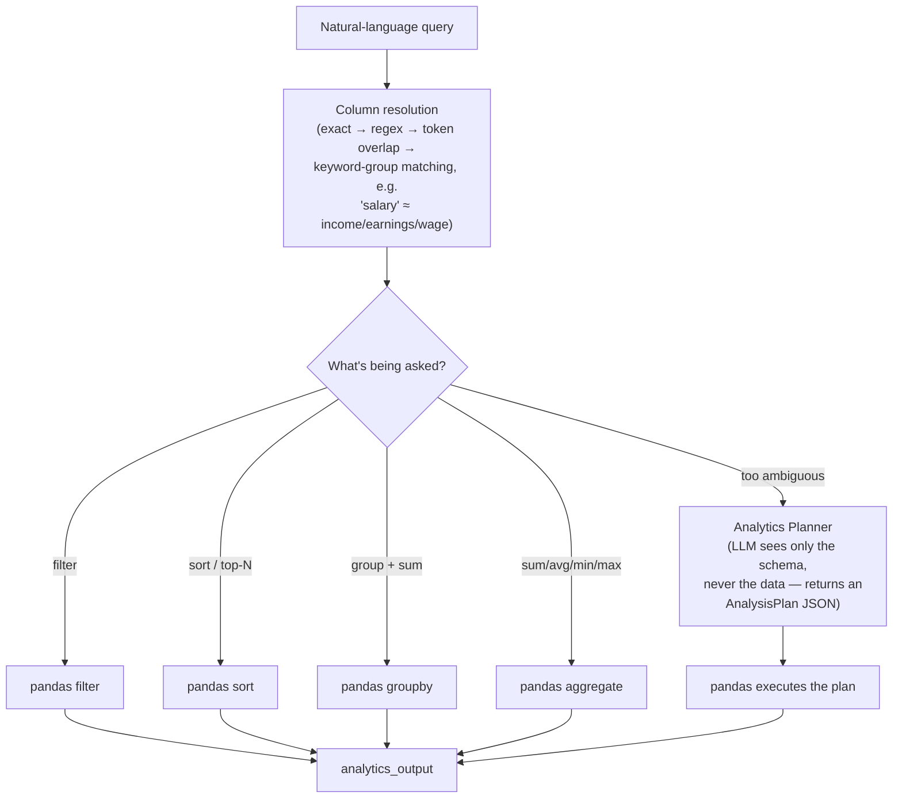
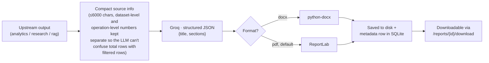

<div align="center">

# ⚡ AgentOS

### Multi-Agent AI Operating System for Conversation, Document Retrieval, Data Analytics, Research & Report Generation

<p>
  
  
  
  
  
  
  
</p>

*A Supervisor Agent reads a request, decides which specialized agent (or agent pair) can actually handle it, and routes accordingly — instead of funnelling every request through one big prompt.*

</div>

---

## Contents

- [What this is](#what-this-is)
- [The problem it addresses](#the-problem-it-addresses)
- [Architecture](#architecture)
- [The shared state contract](#the-shared-state-contract)
- [The agents](#the-agents)
- [Request flows in detail](#request-flows-in-detail)
- [Persistence layer](#persistence-layer)
- [Tech stack](#tech-stack)
- [API reference](#api-reference)
- [Frontend](#frontend)
- [Project structure](#project-structure)
- [Running it locally](#running-it-locally)
- [Engineering decisions](#engineering-decisions)
- [Current scope & what's next](#current-scope--whats-next)

---

## What this is

AgentOS is a **FastAPI + LangGraph backend** paired with a **React workspace**, built around one idea: a single **Supervisor Agent** classifies every incoming request into a structured `ExecutionPlan` and routes it to exactly one specialized agent (or one approved two-step sequence), rather than answering everything with one undifferentiated prompt.

Five agents sit behind the Supervisor:

| Agent | Handles |
|---|---|
| **Chat** | General conversation and explanation |
| **RAG** | Question answering grounded in uploaded PDFs/DOCX/TXT |
| **Analytics** | Natural-language queries against uploaded CSV/XLS/XLSX data |
| **Research** | Open-ended questions answered from the model's own knowledge |
| **Document** | Turns another agent's output into a downloadable PDF or DOCX report |

What makes this more than a chatbot with extra steps:

- **Routing is a validated decision, not a guess.** The Supervisor's LLM output is parsed and checked against an explicit allow-list of agents and agent sequences before anything executes.
- **RAG can say "I don't know."** Retrieval results pass through a relevance gate before generation — if nothing clears the bar, the agent returns that the documents don't contain the answer instead of letting the model improvise.
- **Analytics is computed, not guessed by an LLM.** Column matching, filtering, sorting, and aggregation run locally in pandas. The model is only ever asked to *plan* an operation for genuinely ambiguous requests — it never sees the dataset and never performs the arithmetic.
- **One shared, typed state object.** Every agent reads and writes a single Pydantic `AgentState` that flows through the LangGraph graph — no agent calls another agent directly, and each agent may only write to the output field it owns.

---

## The problem it addresses

A single-prompt chatbot handles

> "Explain dependency injection."

and

> "What does the candidate's resume say about their FastAPI experience?"

and

> "What's the average order value by region in this spreadsheet, and can you put that in a PDF for me?"

as the same kind of request — one string in, one string out. In practice those three questions need three completely different capabilities: general reasoning, grounded retrieval over private documents, and deterministic computation over structured data, followed by a completely separate artifact-generation step. Merging all of that into one prompt makes the system harder to reason about, harder to debug when it's wrong, and impossible to extend safely.

AgentOS instead gives each responsibility its own agent with its own validation, its own failure mode, and its own slice of a shared state object — with a Supervisor whose only job is deciding which one (or two, in sequence) should run.

---

## Architecture

The backend is a compiled **LangGraph `StateGraph`** (`backend/workflows/agent_workflow.py`). Every request enters at `supervisor`, is routed to exactly one first agent, and — for three specific source→artifact sequences — can be routed on to `document` before aggregation:



Only three multi-agent sequences are permitted — `analytics → document`, `research → document`, `rag → document` — and this is enforced twice: once when the Supervisor's LLM output is parsed (`supervisor_agent.py`), and again by the graph's conditional edges (`route_after_agent` in `agent_workflow.py`), which only advance to `document` for those exact plans.

---

## The shared state contract

Every node in the graph reads and mutates the same Pydantic model. It's the only channel agents use to communicate — there is no direct agent-to-agent call anywhere in the codebase:

```python
class AgentState(BaseModel):
    # Input
    query: str
    uploaded_files: List[str] = []
    conversation_history: List[Dict[str, Any]] = []

    # Supervisor
    execution_plan: Optional[ExecutionPlan] = None   # {agents: [...], reason: str}

    # Agent outputs — each agent writes only its own field
    research_output: Optional[Dict[str, Any]] = None
    rag_output: Optional[Dict[str, Any]] = None
    analytics_output: Optional[Dict[str, Any]] = None
    document_output: Optional[Dict[str, Any]] = None
    chat_output: Optional[Dict[str, Any]] = None

    # Bookkeeping
    workflow_trace: List[WorkflowTraceEvent] = []
    errors: List[str] = []

    # Output
    final_response: Optional[str] = None
    status: str = "pending"   # pending | running | completed | failed
```

Every agent implements the same two-method interface (`backend/agents/base_agent.py`):

```python
class BaseAgent(ABC):
    @abstractmethod
    def validate(self, state: AgentState) -> bool: ...
    @abstractmethod
    def execute(self, state: AgentState) -> AgentState: ...
```

`workflow_trace` is populated as each node runs and is returned to the frontend, where it drives the live graph view in the workspace UI.

---

## The agents

<table>
<tr><th>Agent</th><th>File</th><th>Owns</th><th>Responsibility</th></tr>
<tr><td><b>Supervisor</b></td><td><code>supervisor_agent.py</code></td><td><code>execution_plan</code>, <code>final_response</code></td><td>Classifies intent into a validated <code>ExecutionPlan</code>; aggregates whichever downstream agent produced output into <code>final_response</code></td></tr>
<tr><td><b>Chat</b></td><td><code>chat_agent.py</code></td><td><code>chat_output</code></td><td>General-purpose conversational responses via the LLM</td></tr>
<tr><td><b>RAG</b></td><td><code>rag_agent.py</code></td><td><code>rag_output</code></td><td>Hybrid retrieval over uploaded documents, gated by a relevance check, with grounded generation and deduplicated citations</td></tr>
<tr><td><b>Analytics</b></td><td><code>analytics_agent.py</code></td><td><code>analytics_output</code></td><td>Deterministic pandas operations (filter/sort/group/aggregate) over uploaded CSV/XLS/XLSX, with an LLM-authored plan as fallback for complex requests</td></tr>
<tr><td><b>Research</b></td><td><code>research_agent.py</code></td><td><code>research_output</code></td><td>Answers open-ended questions from the model's general knowledge, explicitly instructed not to draw on private documents or invent sources</td></tr>
<tr><td><b>Document</b></td><td><code>document_agent.py</code></td><td><code>document_output</code></td><td>Converts another agent's output into a structured report, then a real PDF or DOCX file</td></tr>
</table>

---

## Request flows in detail

<details>
<summary><b>RAG — hybrid retrieval with a relevance gate</b></summary>
<br>



- Documents are chunked per-page on ingestion (`document_ingestion_service.py`) so every chunk carries a `source` filename and, for PDFs, a real page number — this is what makes citations possible.
- The relevance gate (`retrieval_service._is_relevant`) accepts a result only if it has a strong semantic match, **or** a strong BM25 score combined with reasonable semantic similarity — a small positive BM25 score alone isn't enough. If nothing clears the bar, the agent reports that the documents don't contain the answer instead of generating one anyway.
- The RAG Agent builds two separate outputs from the same retrieval: a clean, deduplicated `sources` list (grouped by document + page) for the user, and a fuller `retrieved_chunks` trace with individual scores, kept for backend observability rather than shown in the UI.

</details>

<details>
<summary><b>Analytics — deterministic first, LLM planning as fallback</b></summary>
<br>



- Column matching is normalization-aware: `Customer_Age`, `customer-age`, and `Customer Age` all resolve to the same column, and a fallback keyword-group table maps terms like *income / earnings / salary / wage / revenue* onto whichever numeric column is actually present.
- The complete dataset is never sent to the LLM under any path. The deterministic path never calls the LLM at all; the planner path sends only the column names and dtypes.

</details>

<details>
<summary><b>Document — structured content, then a real file</b></summary>
<br>



- The LLM's only job is producing structured `{title, sections}` JSON — it never touches file generation. `DocumentService` is a plain, LLM-free class that turns that JSON into an actual `.docx` or `.pdf` with ReportLab/python-docx.
- Format is inferred from the request text (`"docx"` / `"word document"` → DOCX, otherwise PDF) and the source agent(s) are auto-detected from which output fields are populated on the state.

</details>

<details>
<summary><b>Supervisor — intent classification, not keyword matching</b></summary>
<br>

The routing prompt (`prompts/supervisor_prompt.py`) is explicit that an uploaded file doesn't automatically mean the RAG agent should run — *"What is Python?"* with a resume attached is still `chat`, because the file is irrelevant to that question. The same principle applies to Analytics (numbers present ≠ analytics needed) and Research (a topic existing ≠ research needed). The model returns JSON such as `{"agents": ["analytics", "document"]}`, which `supervisor_agent.create_plan()` then validates against the allow-list before it's trusted.

</details>

---

## Persistence layer

Two stores, kept deliberately separate — a rule enforced directly in the code comments (`"embeddings live only here, never in SQLite"`):

| Store | Used for | Tables / collections |
|---|---|---|
| **SQLite** (SQLAlchemy ORM) | Conversations, uploaded-file records, generated-report metadata | `conversations`, `messages`, `uploaded_files`, `generated_reports` |
| **ChromaDB** (persistent client) | Document chunk embeddings for RAG | single `document_embeddings` collection, filterable by `file_id` |

`MemoryService` is intentionally a plain read/write service against SQLite, not an LLM-driven agent — conversation history is simple persistence, not something that needs reasoning.

---

## Tech stack

<table>
<tr><th>Layer</th><th>Technology</th></tr>
<tr><td><b>API</b></td><td>FastAPI, Uvicorn, Pydantic v2 / pydantic-settings</td></tr>
<tr><td><b>Orchestration</b></td><td>LangGraph (<code>StateGraph</code>), LangChain core</td></tr>
<tr><td><b>LLM (generation)</b></td><td>Groq API — <code>openai/gpt-oss-120b</code> (chat, routing, analytics planning, document drafting — all via one centralized <code>LLMService</code>)</td></tr>
<tr><td><b>Embeddings</b></td><td>Google Gemini embedding model, 768-dimensional vectors</td></tr>
<tr><td><b>Vector store</b></td><td>ChromaDB (persistent, local)</td></tr>
<tr><td><b>Relational store</b></td><td>SQLite via SQLAlchemy</td></tr>
<tr><td><b>Lexical search</b></td><td>rank-bm25 (BM25Okapi)</td></tr>
<tr><td><b>Data analytics</b></td><td>pandas, openpyxl</td></tr>
<tr><td><b>Document generation</b></td><td>python-docx, ReportLab</td></tr>
<tr><td><b>Document parsing</b></td><td>pypdf, python-docx (ingestion side)</td></tr>
<tr><td><b>Frontend</b></td><td>React 18, Vite, React Router, Tailwind CSS</td></tr>
<tr><td><b>Workflow visualization</b></td><td>React Flow</td></tr>
<tr><td><b>UI polish</b></td><td>Framer Motion, lucide-react, react-markdown + remark-gfm</td></tr>
<tr><td><b>HTTP client</b></td><td>Axios</td></tr>
</table>

---

## API reference

All routes are mounted under `/api/v1`.

| Method | Endpoint | Purpose |
|---|---|---|
| `GET` | `/health` | Liveness check |
| `POST` | `/chat` | Runs a query through the full LangGraph workflow; persists the turn; returns `final_response` + `workflow_trace` |
| `GET` | `/conversations` | Lists conversations (auto-titled from the first user message) |
| `GET` | `/conversations/{id}` | Full message history for one conversation |
| `DELETE` | `/conversations/{id}` | Deletes a conversation and its messages |
| `POST` | `/upload` | Uploads a file; documents (`.pdf/.docx/.txt`) are chunked, embedded, and indexed into ChromaDB immediately; datasets (`.csv/.xls/.xlsx`) are stored for the Analytics Agent |
| `DELETE` | `/files/{file_id}` | Deletes an uploaded file and its indexed chunks |
| `POST` | `/analyze` | Runs the workflow specifically for an uploaded dataset + instructions |
| `GET` | `/reports` | Lists generated report metadata |
| `GET` | `/reports/{id}/download` | Downloads a generated PDF/DOCX by report ID |
| `DELETE` | `/reports/{id}` | Deletes a report's file and its metadata row |
| `GET` | `/documents/{filename}` | Direct file download with path-traversal and extension validation |

---

## Frontend

A Vite + React SPA (`agentos-scaffold/frontend`) with four routes behind a shared layout:

| Route | Page | What it does |
|---|---|---|
| `/` | **Intro** | Landing view introducing the five agents |
| `/dashboard` | **Dashboard** | Visual overview of the agent system |
| `/workspace` | **AI Workspace** | The main chat surface — file upload, markdown-rendered responses, and a live **React Flow** graph (`WorkflowVisualization.jsx`) that lights up each node as `workflow_trace` events arrive |
| `/analytics` | **Analytics** | Upload a dataset, describe what you want in plain English, get back the computed result plus a dataset overview (rows/columns/numeric columns) |
| `/reports` | **Reports** | Lists, downloads, and deletes previously generated PDF/DOCX reports |

The sidebar also lists and manages saved conversations against the `/conversations` endpoints.

---

## Project structure

```text
agentos-scaffold/
├── backend/
│   ├── agents/                 # Supervisor + 5 specialized agents, all extending BaseAgent
│   │   ├── base_agent.py
│   │   ├── supervisor_agent.py
│   │   ├── chat_agent.py
│   │   ├── rag_agent.py
│   │   ├── analytics_agent.py
│   │   ├── research_agent.py
│   │   └── document_agent.py
│   ├── api/v1/
│   │   ├── router.py            # Aggregates all route modules
│   │   └── routes/               # chat, upload, analyze, conversations, reports, documents, health
│   ├── config/
│   │   ├── settings.py           # pydantic-settings — every env var is read through here
│   │   └── exceptions.py
│   ├── database/
│   │   ├── connection.py         # SQLAlchemy engine/session
│   │   └── chroma_client.py      # ChromaDB persistent client
│   ├── models/                   # SQLAlchemy ORM: conversation, message, uploaded_file, generated_report
│   ├── prompts/                  # One prompt module per agent
│   ├── schemas/                  # Pydantic request/response + AgentState + AnalysisPlan
│   ├── services/
│   │   ├── llm_service.py                # Centralized Groq client — the only place that calls the LLM
│   │   ├── embedding_service.py          # Gemini embeddings for documents + queries
│   │   ├── retrieval_service.py          # Semantic + BM25 + RRF fusion + relevance gate
│   │   ├── document_ingestion_service.py # PDF/DOCX/TXT → chunks → ChromaDB
│   │   ├── analytics_service.py          # pandas operations
│   │   ├── analytics_planner_service.py  # LLM-authored AnalysisPlan (schema only)
│   │   ├── document_service.py           # python-docx / ReportLab file generation
│   │   ├── report_service.py             # Report metadata in SQLite
│   │   ├── memory_service.py             # Conversation persistence (plain SQLite, not an agent)
│   │   └── file_service.py               # Upload handling, ID resolution, deletion
│   ├── workflows/
│   │   └── agent_workflow.py     # The compiled LangGraph StateGraph
│   ├── utils/
│   ├── main.py                   # FastAPI app + CORS + startup DB init
│   └── requirements.txt
├── frontend/
│   ├── src/
│   │   ├── pages/                # Intro, Dashboard, Workspace, Analytics, Reports
│   │   ├── components/
│   │   │   ├── workflow/         # WorkflowVisualization + AgentNode (React Flow)
│   │   │   ├── layout/           # Header, Sidebar (conversation list)
│   │   │   └── common/
│   │   ├── hooks/                # useChat, useWorkflow
│   │   └── services/             # api.js + per-feature API wrappers
│   ├── package.json
│   └── vite.config.js
└── docs/
```

---

## Running it locally

**Backend**

```bash
cd agentos-scaffold/backend
python -m venv .venv && source .venv/bin/activate
pip install -r requirements.txt

# required
export GROQ_API_KEY="..."        # LLM generation — chat, routing, analytics planning, document drafting
export GEMINI_API_KEY="..."      # embeddings only (RAG)

uvicorn main:app --reload --port 8000
```

**Frontend**

```bash
cd agentos-scaffold/frontend
npm install
echo "VITE_API_BASE_URL=http://localhost:8000/api/v1" > .env
npm run dev
```

All other configuration (model names, chunk size, retrieval weights, CORS origins, storage paths) has sane defaults in `backend/config/settings.py` and can be overridden via environment variables or a `.env` file — nothing outside that module reads `os.environ` directly.

---

## Engineering decisions

A few constraints that are enforced in code, not just described in comments:

- **Single point of LLM contact.** Every agent calls the same `llm_service.generate()` — no agent instantiates its own client. Swapping providers is a one-file change in principle, though only Groq is wired up today.
- **No agent calls another agent.** The Supervisor is the only router; every other agent only ever reads/writes `AgentState`.
- **Each agent owns exactly one output field.** `rag_agent` never touches `analytics_output`, and vice versa — this is what makes the aggregation step in `SupervisorAgent.aggregate()` safe to reason about.
- **The dataset never reaches the LLM.** Not for analytics, not for document generation — only schemas, column names, and already-computed results are ever sent.
- **Supervisor decisions are validated, not trusted.** The LLM's routing JSON is parsed and checked against an explicit allow-list before the graph acts on it.

---

## Current scope & what's next

Built as a from-scratch, single-developer system in a fixed timeframe — the following are deliberately out of scope for now rather than oversights:

- Authentication, multi-user support, and role-based access
- Containerization (Docker) and CI/CD
- Automated test suite
- Live token/step streaming to the frontend — `workflow_trace` is currently returned once the full LangGraph run completes, not streamed incrementally (`useWorkflow.js` has this staged as a `TODO` for an SSE-based follow-up)
